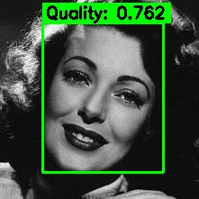
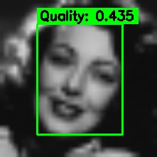
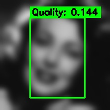
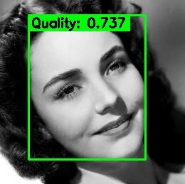
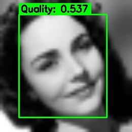
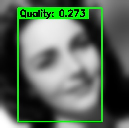

# Face Image Quality Assessment

[](https://github.com/yakhyo/face-image-quality-assessment/releases)
[](LICENSE)

> [!TIP]
> The models and functionality in this repository are **integrated into [UniFace](https://github.com/yakhyo/uniface)** — an all-in-one face analysis toolkit.<br>
> [](https://pypi.org/project/uniface/) [](https://github.com/yakhyo/uniface/stargazers)

PyTorch inference, ONNX export, and ONNX Runtime inference for [eDifFIQA](https://github.com/LSIbabnikz/eDifFIQA) — a face image quality estimator that predicts a single quality score from an aligned 112×112 face. Uses [UniFace](https://github.com/yakhyo/uniface) for face detection and alignment.

## Models

| Variant | Backbone | Params | Input | PyTorch (.pth) | ONNX |
| ------- | -------- | ------ | ----- | -------------- | ---- |
| eDifFIQA-T | MobileFaceNet | 1.7M  | 112x112 | [Link](https://github.com/yakhyo/face-image-quality-assessment/releases/download/weights/ediffiqa_t.pth) | [Link](https://github.com/yakhyo/face-image-quality-assessment/releases/download/weights/ediffiqa_t.onnx) |
| eDifFIQA-S | IResNet-18    | 24.6M | 112x112 | [Link](https://github.com/yakhyo/face-image-quality-assessment/releases/download/weights/ediffiqa_s.pth) | [Link](https://github.com/yakhyo/face-image-quality-assessment/releases/download/weights/ediffiqa_s.onnx) |
| eDifFIQA-M | IResNet-50    | 44.1M | 112x112 | [Link](https://github.com/yakhyo/face-image-quality-assessment/releases/download/weights/ediffiqa_m.pth) | [Link](https://github.com/yakhyo/face-image-quality-assessment/releases/download/weights/ediffiqa_m.onnx) |
| eDifFIQA-L | IResNet-100   | 65.7M | 112x112 | [Link](https://github.com/yakhyo/face-image-quality-assessment/releases/download/weights/ediffiqa_l.pth) | [Link](https://github.com/yakhyo/face-image-quality-assessment/releases/download/weights/ediffiqa_l.onnx) |

Higher score = better quality. Authors evaluate against 10 FIQA competitors on 7 static-image datasets + 1 video dataset using EDC curves; LFW and XQLFW are the commonly cited references for high-quality vs. low-quality regimes. eDifFIQA-L ranks first on the NIST [FATE-Quality](https://pages.nist.gov/frvt/html/frvt_quality.html) Kiosk-to-Entry track. See the [paper](https://ieeexplore.ieee.org/document/10468647) for per-dataset numbers.

> `.pth` weights are ported from the upstream authors' [OneDrive folder](https://unilj-my.sharepoint.com/:f:/g/personal/zb4290_student_uni-lj_si/EpxkJRo7artCud18dC2NAXcBAegU0uDaSMPwzG9ufcXkLg?e=zhsnho); `.onnx` files are exported from those weights and mirrored to this repo's release.

## Installation

```bash
pip install -r requirements.txt
bash download.sh
```

## Demo

eDifFIQA-T quality scores on `assets/test_images/`. The same face, progressively degraded, gets a sharply lower score:

| Original | Down-up sampled | Heavy blur |
| :------: | :-------------: | :--------: |
| <br>**0.762** | <br>**0.435** | <br>**0.144** |
| <br>**0.737** | <br>**0.537** | <br>**0.273** |

## Inference

Inputs are aligned 112×112 face crops. Pass a full image and alignment is handled for you; use `--aligned` or `score_aligned()` to skip it for already-aligned crops.

### PyTorch

```bash
python main.py assets/test_images/image2.jpg --variant s
```

Pre-aligned 112×112 crops:

```bash
python main.py --aligned aligned_face.jpg --variant s
```

### ONNX

```bash
python onnx_inference.py --model weights/ediffiqa_s.onnx assets/test_images/image2.jpg
```

```python
import cv2
from models import eDifFIQAOnnx
from uniface.detection import SCRFD

detector = SCRFD()
quality = eDifFIQAOnnx("weights/ediffiqa_s.onnx")

image = cv2.imread("image.jpg")
for face in detector.detect(image):
    score = quality.get_quality(image, face.landmarks)
    print(f"Quality: {score:.4f}")
```

## ONNX Export

```bash
python onnx_export.py -v s -w weights/ediffiqa_s.pth -o weights/ediffiqa_s.onnx --dynamic
```

## Reference

- [eDifFIQA](https://github.com/LSIbabnikz/eDifFIQA) — Original PyTorch implementation and paper
- [UniFace](https://github.com/yakhyo/uniface) — Face detection and alignment

## License

[MIT License](./LICENSE)
